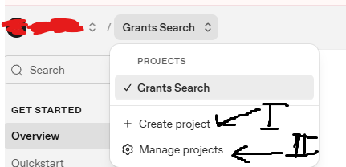
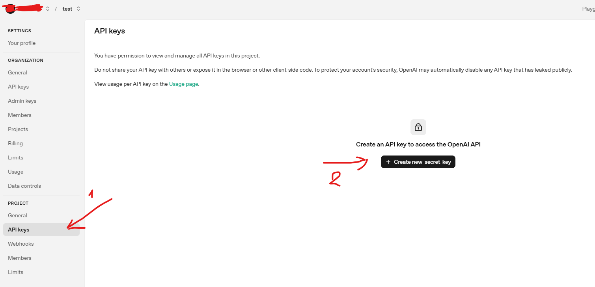
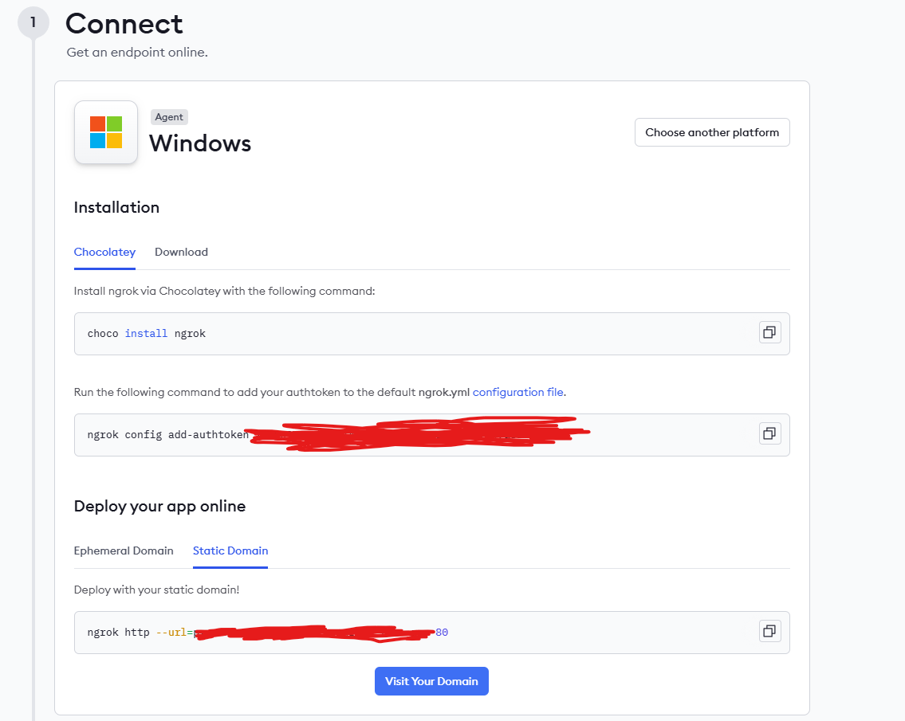

# Про проєкт
Ця програма автоматично збирає інформацію про гранти з різних джерел, аналізує її за допомогою ChatGPT, надсилає знайдені щотижня гранти в Slack, та дозволяє переглядати журнал через зручний інтерфейс бота. Перегляньте [інструкцію експлуатації](#інструкція-експлуатації).

## Структура проєкту
```
├── src/
│   ├── config/
│   │   └── index.js           # Конфігураційні налаштування
│   ├── lib/
│   │   └── db.js              # Робота з базою даних MySQL
│   ├── scrapers/
│   │   ├── baseScraper.js     # Базовий клас для парсерів
│   │   ├── prostirScraper.js  # Парсер під платформу Prostir, який доповнює baseScraper.js
│   │   ├── gurtScraper.js     # Парсер під платформу Gurt, який доповнює baseScraper.js
│   │   ├── ...
│   ├── services/
│   │   ├── openai.js          # Інтеграція з OpenAI для категоризації
│   │   └── slack.js           # Slack-бот та інтерактивний інтерфейс
│   └── main.js                # Головний файл додатку
├── package.json
├── example.env                # Приклад конфігурації
└── README.md
```

## Залежності
- **@slack/bolt** - Slack Bolt framework для бота
- **axios** - HTTP-клієнт для запитів
- **cheerio** - jQuery-подібний парсер HTML
- **dotenv** - Завантаження змінних середовища
- **mysql2** - MySQL драйвер для Node.js
- **node-cron** - Планувальник завдань
- **playwright** - Бібліотека для автоматизації браузера

# Інструкція експлуатації

## Встановлення
1. **Клонуйте репозиторій:**
   ```bash
   git clone <URL репозиторію>
   cd grants-search
   ```

2. **Встановіть залежності:**
   ```bash
   npm install
   ```

3. **Встановіть Playwright браузери:**
   ```bash
   npx playwright install
   ```

4. **Створіть файл `.env`**, скопіювавши `example.env`:
   ```bash
   cp for_user/example.env .env
   ```

## Конфігурація
Перед запуском програми, користувач зобов'язаний підготувати необхідну інфраструктуру та заповнити конфігурацію.
1. Створіть та налаштуйте базу даних MySQL
2. Налаштуйте API Slack та OpenAi.
3. Створіть та заповніть ENV-конфіг
4. Налаштуйте власний домен чи використайте ngrok-тунель

### Налаштування бази даних
1. Встановіть та налаштуйте базу даних MySQL
[Гайд для встановлення на Debian-подібні системи](https://dev.mysql.com/doc/refman/8.4/en/linux-installation-apt-repo.html)

### Налаштування OpenAI API
1. **Додайте гроші на акаунт та отримайте API ключ:**
   - Перейдіть на [OpenAI API](https://platform.openai.com/signup)
   - Створіть обліковий запис та проєкт та отримайте API ключ
   
   
   - Перейдіть до [OpenAI Billing Info](https://platform.openai.com/settings/organization/billing/overview) та поповніть баланс.
   (Програма використовує в середньому 0.01-0.02$ на обробку 500 посилань).

### Налаштування Slack-бота
0. **Підготуйте домен/Ngrok**
Ваш домен має посилатись на адресу та порт програми (порт 3000). Якщо ви не бажаєте використовувати домен, налаштуйте тунель Ngrok.
 
   - Встановіть ngrok (якщо ще не встановлений):
   ```bash
   # Завантажте з https://ngrok.com/download або встановіть через пакетний менеджер.
   # На вебсайті ви маєте зареєструватися та налаштувати Ngrok перед першим запуском, використовуючи інструкції з їхнього сайту. Вам необхідні налаштування під "Static Domain"
   ```
   

  Скопіюйте ваш Static Domain, він вам знадобиться.

1. **Створіть Slack-додаток:**
   - Перейдіть на [Slack API](https://api.slack.com/apps)
   - Натисніть "Create New App" → "From scratch"
   - Введіть назву додатку та виберіть робочий простір

2. **Налаштуйте додаток:**
   - В дешборді вашого додатку перейдіть до вкладки ```App Manifest```
   - Вставте в поле для маніфесту контент файлу for_user/manifest.json та змініть назви за бажанням
   - Замініть шаблони `request_url` на `ваш-домен_або_домен-від-ngrok/slack/events` та збережіть зміни
3. **Отримайте необхідну інформацію зі Slack-API**
   - `Signing Secret` на вкладці `Basic Information` в дешборді.
   - На вкладці `OAuth & Permissions` додайте вашого бота в необхідний воркспейс та скопіююйте наданий `Bot User OAuth Token`
   - Натисніть ПКМ по каналу слек, в який програма надсилатиме репорти щотижня. Скопіююйте посилання `Copy -> Copy link`

### ENV-конфіг
1. **Заповніть `.env` файл вашими даними:**
   - `DB_HOST`: хост бази даних (зазвичай `localhost`)
   - `DB_USER`: ім'я користувача MySQL
   - `DB_PASSWORD`: пароль користувача MySQL
   - `SLACK_BOT_TOKEN`: токен Slack-бота (починається з `xoxb-`)
   - `SLACK_SIGNING_SECRET`: секрет підпису Slack-додатку
   - `SLACK_CHANNEL_ID`: ID каналу для автоматичних звітів
   - `OPENAI_API_KEY`: ключ OpenAI API (починається з `sk-`)

2. **Змініть додаткові налаштування:**
Перегляньте налаштування та встановіть свої за потребами у вкладках `Global scraping parameters`, `Specific scraping parameters`, `App behavior configuration`

## Запуск
1. **Запустіть тунель Ngrok як фоновий процес:**
  ```bash
  tmux new-session -d -s ngrok_session 'ngrok http --url=ваш-лінк.ngrok-free.app 3000'
  ```

2. **Запустіть програму:**
   ```bash
   npm start
   ```

# Для розробників

Мене попросили зробити можливість додавати нові парсери платформ не змінюючи основний код, тому пропоную вам наступне рішення при створенні нових скрейперів/парсерів. 

1. Скопіюйте хтмл-контент блоку на сторінці, звідки потрібно парсити гранти.

2. Використайте в вашому IDE інструменти для "agentic coding" (наприклад, `Github Copilot`).

3. Надайте вашому агенту ваш хтмл-контент та цей readme-файл в якості контексту. Попросіть у промпті створити новий файл скрейперу та вкажіть, як працює пагінація на сайті чи інші ньюанси(яку кнопку треба тиснути, щоб перейти на наступну сторінку. Який лінк є 1-ою сторінкою, 2-ою тощо. Чи треба очікувати завантаження на сайті).

4. Після створення нового скрейперу, ваш агент скоріше за все, запише новий скрейпер в файл main.js (масив sources та імпорти зверху). Якщо цього не станеться, додайте вручну.

Наступна секція, це пояснення як працює код проєкту написана ШІ

## Розбір коду

### Архітектура програми

Програма побудована за модульним принципом з чіткою архітектурою, що складається з кількох ключових компонентів:

#### 1. Точка входу - `src/main.js`
Головний файл програми, що:
- **Ініціалізує конфігурацію** з `.env` файлу
- **Керує lifecycle** всіх скрейперів та сервісів
- **Планує завдання** за допомогою `node-cron`
- **Координує процес збору даних**

```javascript
const sources = [
    gurtScraper,
    prostirScraper,
    grantMarketScraper,
    euScraper,
    opportunityDeskScraper
];
```

**Основні функції:**
- `scrapeAll()` - запускає всі скрейпери послідовно
- `setupScheduledJobs()` - налаштовує автоматичні завдання
- Обробка помилок та логування результатів

#### 2. Базовий скрейпер - `src/scrapers/baseScraper.js`
Абстрактний клас, що забезпечує:
- **Управління браузером** через Playwright
- **Повторні спроби** при помилках
- **Загальну логіку обробки** HTML-контенту
- **Інтеграцію з OpenAI** для аналізу тексту

**Ключові методи:**
```javascript
class BaseScraper {
  async _initBrowser()           // Ініціалізація браузера
  async _getPageContent(url)     // Отримання HTML контенту
  async _processGrantUrls(urls)  // Обробка списку посилань
  async _extractGrantData(url)   // Витягування даних з одного гранту
  async _closeBrowser()          // Закриття браузера
}
```

#### 3. Специфічні скрейпери
Кожен скрейпер наслідується від `BaseScraper` та реалізує:
- Специфічну логіку для конкретного сайту
- Методи навігації (пагінація, кнопки "показати більше")
- CSS-селектори для витягування посилань

**Приклад структури скрейпера:**
```javascript
class ProstirScraper extends BaseScraper {
  async scrape() {
    // 1. Отримати HTML сторінки
    // 2. Знайти всі посилання на гранти
    // 3. Передати посилання для обробки в базовий клас
  }
}
```

#### 4. Сервіс OpenAI - `src/services/openai.js`
Відповідає за:
- **Аналіз тексту грантів** за допомогою GPT
- **Категоризацію** грантів за предвизначеними категоріями
- **Витягування структурованих даних** (назва, дедлайн, категорія)
- **Обробку помилок** AI та повторні спроби

**Процес обробки:**
1. Валідація вхідного тексту
2. Обрізання тексту до максимальної довжини
3. Формування промпту для AI
4. Отримання відповіді та парсинг JSON
5. Збереження невдалих спроб в базу даних

#### 5. База даних - `src/lib/db.js`
Керує всіма операціями з MySQL:
- **Створення таблиць** при першому запуску
- **Збереження грантів** з дедуплікацією за URL
- **Очищення застарілих записів**
- **Надання API** для Slack-бота

**Основні таблиці:**
- `grants` - основна таблиця з грантами
- `rejected_grants` - лог невдалих AI-аналізів

#### 6. Slack-інтеграція - `src/services/slack.js`
Забезпечує:
- **Інтерактивний бот** з командою `/grants`
- **Щотижневі звіти** про нові гранти
- **Фільтрацію та пагінацію** в Slack-інтерфейсі
- **Форматування дат** для українських користувачів

### Потік даних

```
[Веб-сайт] → [Скрейпер] → [OpenAI] → [База даних] → [Slack-бот]
     ↓            ↓          ↓           ↓             ↓
1. HTML      2. Посилання  3. Аналіз   4. Збереження  5. Відображення
```

### Конфігураційні параметри

Програма підтримує гнучку конфігурацію через `.env` файл:

**Глобальні параметри скрейпінгу:**
- `MAX_PAGES` - максимум сторінок для одного скрейпера
- `MAX_GRANTS` - максимум грантів за один запуск
- `BATCH_SIZE` - кількість паралельних запитів до AI
- `BATCH_DELAY` - затримка між батчами (rate limiting)

**Специфічні параметри:**
- `EU_CONTENT_WAIT_TIME` - час очікування завантаження EU Portal
- `GRANT_MARKET_MAX_LOAD_MORE` - максимум кліків "показати більше"

**Поведінка додатку:**
- `ENABLE_SCHEDULED_SCRAPING` - автоматичний збір (понеділок 8:00)
- `ENABLE_SCHEDULED_REPORTS` - автоматичні звіти (понеділок 9:00)
- `RUN_SCRAPING_ON_STARTUP` - запуск збору при старті

### Обробка помилок

Програма має кілька рівнів обробки помилок:

1. **Рівень скрейпера**: повторні спроби при помилках мережі
2. **Рівень AI**: збереження невдалих аналізів для дебагінгу
3. **Рівень бази даних**: обробка дублікатів та валідація
4. **Рівень програми**: логування та продовження роботи

### Масштабування та оптимізація

**Паралельна обробка:**
- Батчева обробка грантів через OpenAI
- Налаштовувані затримки для дотримання rate limits
- Повторне використання браузерних сесій

**Оптимізація ресурсів:**
- Закриття браузерів після завершення скрейпінгу
- Очищення застарілих грантів з бази
- Дедуплікація за URL для уникнення повторної обробки

### Логування та моніторинг

Програма веде детальне логування:
- Статистика по кожному скрейперу
- Помилки AI та їх збереження
- Результати щотижневих звітів
- Стан Slack-бота

### Розширення функціональності

**Додавання нового скрейпера:**
1. Створити клас, що наслідує `BaseScraper`
2. Реалізувати метод `scrape()`
3. Додати в масив `sources` в `main.js`
4. Налаштувати специфічні параметри в `.env`

**Модифікація AI-аналізу:**
- Змінити промпт в `openai.js`
- Додати нові категорії в масив `categories`
- Налаштувати параметри моделі (temperature, max_tokens)

**Кастомізація Slack-інтерфейсу:**
- Змінити блоки в `buildGrantsView()`
- Додати нові команди та обробники подій
- Налаштувати формат звітів

# Ліцензія
Цей проєкт ліцензований на умовах MIT License. Ви можете вільно використовувати, змінювати та розповсюджувати його, дотримуючись умов ліцензії. Будь ласка, збережіть цей файл README.md та вкажіть авторство при використанні коду.


